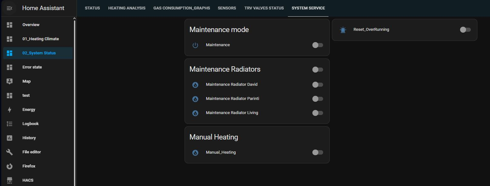

## ESP Module for Home Assistant-Integrated Heating System  with 3 zones

This project is an open-source solution that integrates an ESP module with Home Assistant to control a heating system. The system consists of a boiler for centralized heating and three individual heating zones. Each zone is managed by a TRV (Thermostatic Radiator Valve) that operates via Zigbee technology, ensuring precise temperature control in each area. Communication between the ESP module and Home Assistant is facilitated through MQTT, providing real-time data exchange and control.

## Key Features:

Seamless Home Assistant Integration: Easily control and monitor the heating system through Home Assistant.

Zonal Control: Manage three independent heating zones with TRV valves over Zigbee for efficient and customized heating.

Real-Time MQTT Communication: The ESP module communicates with Home Assistant via MQTT, ensuring swift updates and commands.

Customizability: Adjust heating schedules, temperature setpoints, and other parameters to meet specific needs.

Protection to over running boiler: The system has implemented conditions to prevent boiler over running  in case that one or more sensor fail to measure, in case that  wifi or Home Asssitant is disconnected or malfunction on heating instalation that can increase time to reach or not reach target temperature.

Upgrade firmware via webpage with binary file

Easy to connect to WiFi or reconfigure WiFi. The module become AP and scan WiFi networks available. With your phone have to connect  at ESP AP module and  can select WiFi network , enter password and after this will became client.

## Technologies Involved:

ESP Microcontroller (ESP8266/ESP32): The core component that runs the control logic and manages communications.

Arduion OTA 

Arduino mDNS

Home Assistant: The home automation platform that integrates all components of the heating system.

MQTT Protocol: A lightweight messaging protocol used for fast and efficient communication between the ESP module and Home Assistant.

Zigbee: The wireless communication standard used to control the TRV valves.

## How It Works:

Upon startup, the ESP module connects to the Wi-Fi network and establishes an MQTT connection with Home Assistant. The module send a mesaje at startup to HAS in order to send parameters and adjust temperature setpoints for each heating zone, heating running time, heating pause time, status of TRV valves, hysteresis value. 

The module receive data from Home Assistant like temperatures, target temperatures of each zone and start or stop heating. The module open and close TRV valves and waiting confirmation.

The module actuate boiler and heat till target temperature is reached a zone or all zones just if TRV are online and opened, if Over running time not reached and  connection between MQTT broker and wifi is up .

## Project Setup Overview:

To implement the system, you need to to install HAS, add automations, configure the ESP module to connect to your Wi-Fi. 
Automations and other config will be published here later...

Once connected, Will know to find Home Assistant with mDNS configuration that is defined as homeassistant.local. After this , will start comunication and receive data , also send data to HAS

## Contributing:

Contributions to improve the project are welcome. If you find any issues or have suggestions for enhancements, feel free to share your ideas or submit pull requests. Collaborative efforts will help refine the system and expand its capabilities.

## License:

This project is released under an open-source license, allowing for modifications and redistribution. For detailed licensing information, please refer to the LICENSE file in the repository.

This comprehensive solution aims to provide a reliable and flexible approach to managing home heating, combining modern communication protocols with effective hardware integration for an enhanced user experience.   

## Presentation
Main page ESP 

Menu bar

System info page 

Software upgrade page 

## Home Assitant 
HAS main page

HAS settings

HAS System status 

HAS heating mode 

HAS heating maintenance mode 

